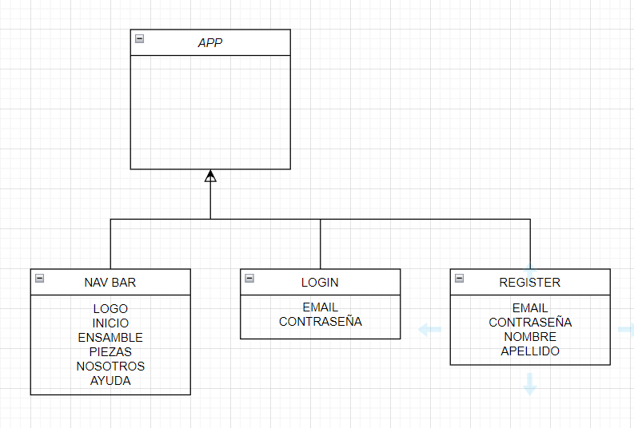
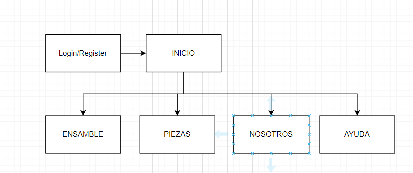
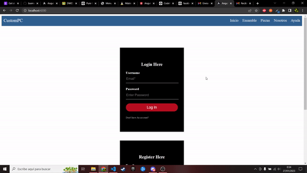
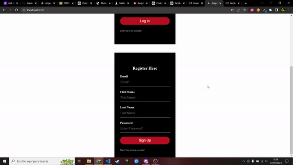
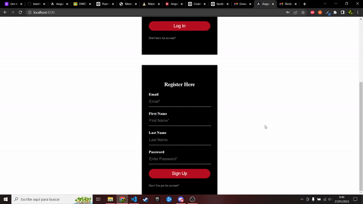

# DWEC
## AN1 LOGIN-REGISTER

> Tarea AVANZADA.

### 🔍 Análisis del problema

`Queremos crear una aplicacion con un login y un register utilizando angular`

#### 🤔 ¿Qué son?

**Diagrama de clase**

---

### 📐 Diseño de la solución

Para realizar este apartado de Tarea AVANZADA, he creado un proyecto en angular y le he añadido componentes.

---

### Boceto Proyecto final

### 💡 Pruebas

**Criterio de aceptación 1**

Dado que escribo bien los datos

Cuando pulsamos login no da fallo

Entonces entraremos en la pagina

**Criterio de aceptación 2**

Dado que no escribo bien los datos

Cuando pulsamos login da fallo

Entonces no entraremos en la pagina

**Criterio de aceptación 3**

Dado que  escribo bien los datos

Cuando pulsamos signup  no da fallo

Entonces nos registraremos correctamente

**Criterio de aceptación 4**

Dado que no escribo bien los datos

Cuando pulsamos signup  da fallo

Entonces no nos registraremos correctamente

