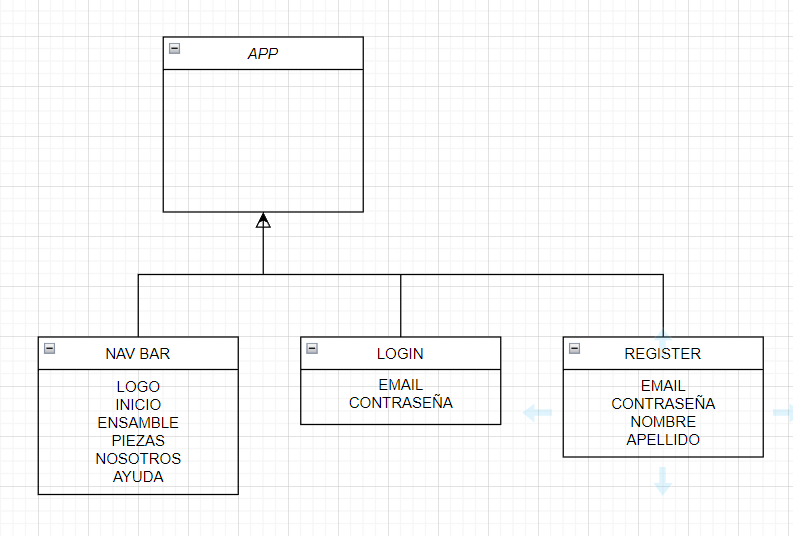
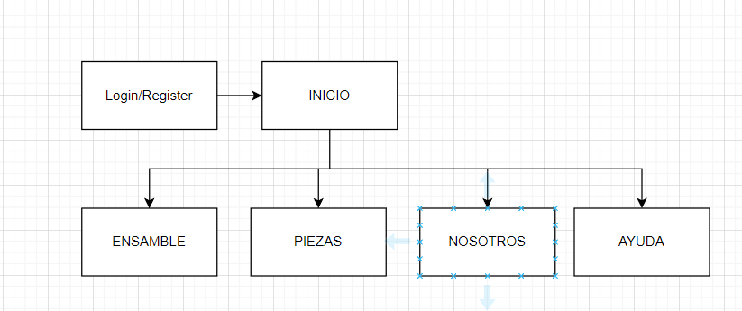
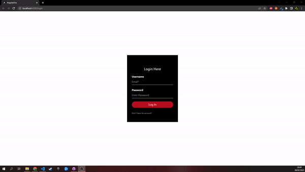

# DWEC
## AN2 PAGINACIÓN

> Tarea AVANZADA.

### 🔍 Análisis del problema

`Queremos crear las rutas para la paginacion de las paginas`

#### 🤔 ¿Qué son?

**Diagrama de clase**

---

### 📐 Diseño de la solución

Para realizar este apartado de Tarea AVANZADA, he creado un proyecto en angular y le he añadido paginas,tambien lo he enrutado para moverme entres las paginas.

---

### Boceto Proyecto final

### 💡 Pruebas

**Criterio de aceptación 1**

Dado que me muevo entre las paginas

Cuando pulsamos cualquier link

Entonces me llevara a la pagina deseada

