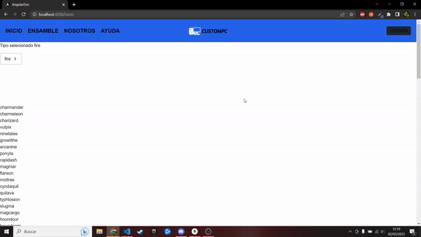

# DWEC
## A3A4 RECOGER DATOS Y MOSTRARLO DE UNA API

> Tarea AVANZADA.

### 🔍 Análisis del problema

`Queremos crear menu desplegable para seleccionar tres tipos de pokemon: FUEGO, AGUA , HIERBA y mostrar todo los pokemon que existen `

#### 🤔 ¿Qué son?

### ngStyle, ngClass y ngTemplate :sunglasses: 

#### ngStyle:

La directiva de atributo ngStyle actualiza los estilos para un elemento HTML determinado. Establece una o más propiedades de estilo, especificadas como pares clave-valor separados por dos puntos. La clave es un nombre de estilo y el valor es una expresión a evaluar o valor a asignar.

Ejemplo: 

`<h1 [ngStyle]="{'color':'red','background-color':'#ff0','text-align':'center'}">Sitio fuera de servicio</h1>`

#### ngClass:

La directiva de atributo [ngClass] permite establecer una o más clases a un elemento HTML. Una alternativa más útil es definir un objeto literal cuyas claves son nombres de clases y sus valores un valor boolean que indica si se debe activar o no la clase al elemento HTML.

Ejemplo:

##### app.component.css
.clase1 {
    color:red;
    background-color:blue;
}

.clase2 {
    font-size:20px;
    font-family: 'Courier New', Courier, monospace;
}

##### app.component.html
`
Prueba de directiva
`
`<button (click)="fijar()">Fijar clases</button>`
`<button (click)="eliminar()">Eliminar clases</button>`
#### ngTemplate:
Esta directiva representa, tal y como se intuye en su nombre, una template de Angular. El contenido de esta etiqueta contendrá una parte de una template que luego se puede reutilizar y añadirse a otras templates para formar la template de un componente.

Ejemplo ngTemplate con ngFor:

`
`

    ` *ngFor="let order of orders; `
             `let x=list;`
             `let main=main; `
             `trackBy: trackById">``
   `({{x}}) {{order.id}}`
`
`

`<ng-template>` 
  ` ngFor let-order [ngForOf]="orders"`
  ` let-x="list" `
   `let-main="main"`
   `[ngForTrackBy]="trackById">`
``
({{x}}) {{order.id}}
``
``</ng-template>``

### 📐 Diseño de la solución

Para realizar este apartado de Tarea AVANZADA, he tenido que crear un dropdown con los tres tipos principales de pokemon, para luego mostrar una lista con los pokemons.

---

### 💡 Pruebas

**Criterio de aceptación 1**

Dado que el menu desplegable cambia

Cuando se cambia

Entonces me mostrara el listado de pokemons

