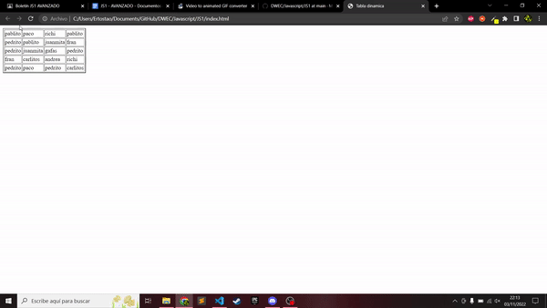
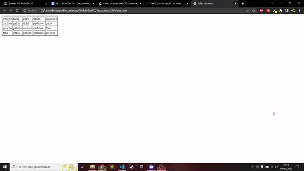
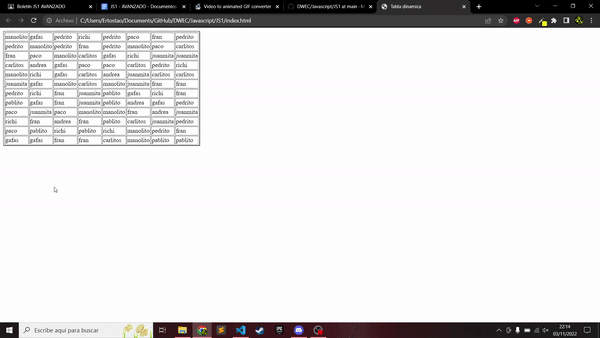

# DWEC
## Tabla dinamica con datos randoms

> Tarea AVANZADA.

### 🔍 Análisis del problema

`Queremos crear una tabla con un script que genere una tbala que queramos,
tanto filas como columnas, y luego que introduzca datos aleatorios a la tabla.`

#### 🤔 ¿Qué son?

**Script**

`Un lenguaje de script es un pequeño lenguaje de programación cuyo código se inserta dentro del documento HTML. Este código se ejecuta en el navegador del usuario al cargar la página, o cuando sucede algo especial como puede ser el pulsar sobre un enlace.`

---

### 📐 Diseño de la solución

Para realizar este apartado de Tarea AVANZADO, he creado un fichero html para el cuerpo de la pagina html y luego lo he llamado desde otro archivo en este caso .JS,donde tengo hecho el script

---

### Implementación

He implementado todo lo anterior, ahora procedo hacer el ejercicio

### 💡 Pruebas

**Criterio de aceptación 1**

Dado que tengo un método generaDatos(5, 4) 
Cuando pongo los valores fila 5 y columna 4
Entonces me aparece en el html una tabla con 5 filas y 4 columnas con datos randoms.

**Criterio de aceptación 2**

Dado que tengo un método generaDatos(4, 5) 
Cuando pongo los valores fila 4 y columna 5
Entonces me aparece en el html una tabla con 4 filas y 5 columnas con datos randoms.

**Criterio de aceptación 3**

Dado que tengo un método generaDatos(12, 8) 
Cuando pongo los valores fila 12 y columna 8
Entonces me aparece en el html una tabla con 12 filas y 8 columnas con datos randoms.

