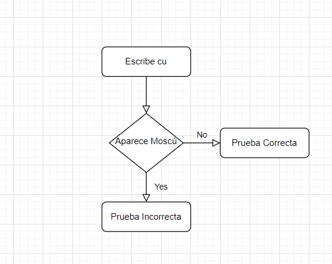
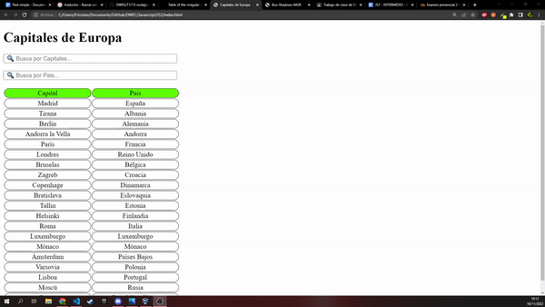
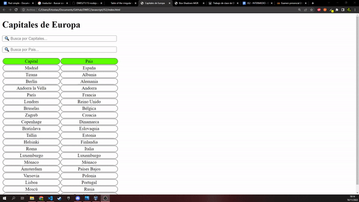
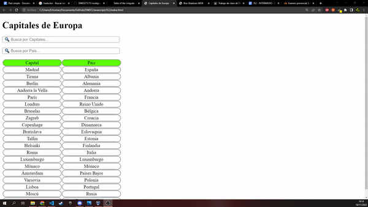
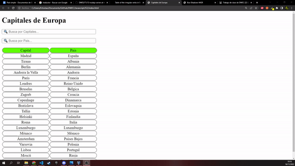
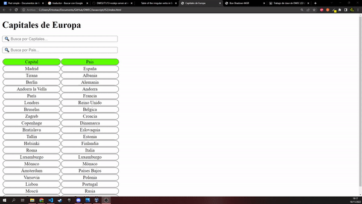

# DWEC
## Tabla generada con JSON

> Tarea INTERMEDIA.

### 🔍 Análisis del problema

`Queremos crear una tabla con un script que genere una tabla que apartir de un JSON se introduzcan los datos en la tabla,
tambien se pide dos filtros tanto para Capitales como para Pais.`

#### 🤔 ¿Qué son?

**Diagrama de flujo**

---

### 📐 Diseño de la solución

Para realizar este apartado de Tarea INTERMEDIO, he creado un fichero html para el cuerpo de la pagina html y luego lo he llamado desde otro archivo en este caso .JS,donde tengo hecho el script, que contiene un json con la lista de paises y capitales.

---

### 💡 Pruebas

**Criterio de aceptación 1**

Dado que tenemos una tabla con las capitales y paises 

Cuando introducimos en el buscador "Berlín"

Entonces aparecerá la tabla con la capital y país únicamente

**Criterio de aceptación 2**

Dado que tenemos una tabla con las capitales y paises 

Cuando introducimos en el buscador "cú"

Entonces aparecerá la tabla con la capital y país únicamente

**Criterio de aceptación 3**

Dado que tenemos una tabla con las capitales y paises 

Cuando introducimos en el buscador "cu"

Entonces aparecerá la tabla sin valores

**Criterio de aceptación 4**

Dado que tenemos una tabla con las capitales y paises 

Cuando introducimos en el buscador "Alemania"

Entonces aparecerá la tabla sin valores

**Criterio de aceptación 5**

Dado que tenemos una tabla con las capitales y paises 

Cuando introducimos en el buscador "Croacia"

Entonces aparecerá la tabla con la capital y país únicamente

**Criterio de aceptación 6**

Dado que tenemos una tabla con las capitales y paises 

Cuando introducimos en el buscador "Bélgica"

Entonces aparecerá la tabla con la capital y país únicamente

**Criterio de aceptación 7**

Dado que tenemos una tabla con las capitales y paises 

Cuando introducimos en el buscador "Belgica"

Entonces aparecerá la tabla sin valores

**Criterio de aceptación 8**

Dado que tenemos una tabla con las capitales y paises 

Cuando introducimos en el buscador "París"

Entonces aparecerá la tabla sin valores

