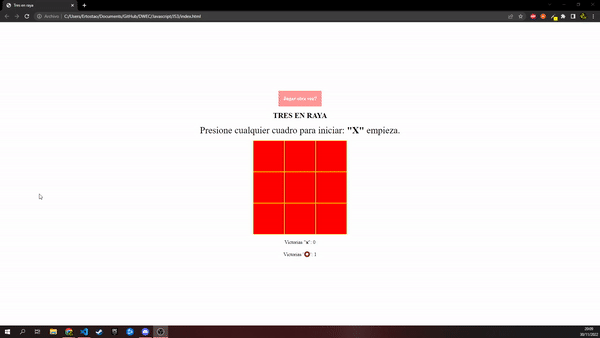
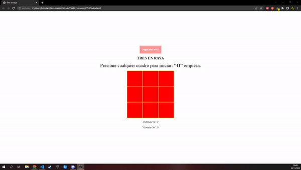

# DWEC
## Tres en raya

> Tarea INTERMEDIA.

### 🔍 Análisis del problema

`Queremos crear un tres en raya funcional que tenga un boton para poder jugar otra vez,
 y un contador que cuente las victorias de cada jugador.`

#### 🤔 ¿Qué son?

**Diagrama de flujo**

---

### 📐 Diseño de la solución

Para realizar este apartado de Tarea INTERMEDIO, he creado un fichero html para el cuerpo de la pagina html y luego lo he llamado desde otro archivo en este caso .JS,donde tengo hecho el script, que contiene un json con las diferentes funciones que utilizamos.

---

### 💡 Pruebas

**Criterio de aceptación 1**

Dado que el jugador X empieza 

Cuando pulsamos se pone X en el cuadro

Entonces tendremos que formar tres en raya para ganar

**Criterio de aceptación 2**

Dado que el jugador O empieza 

Cuando pulsamos se pone O en el cuadro

Entonces tendremos que formar tres en raya para ganar

**Criterio de aceptación 3**

Dado que el jugador X empieza 

Cuando pulsamos se pone X en el cuadro

Entonces tendremos que empatar

