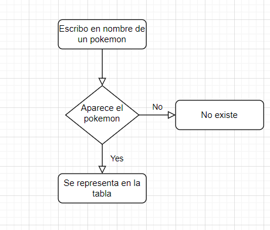
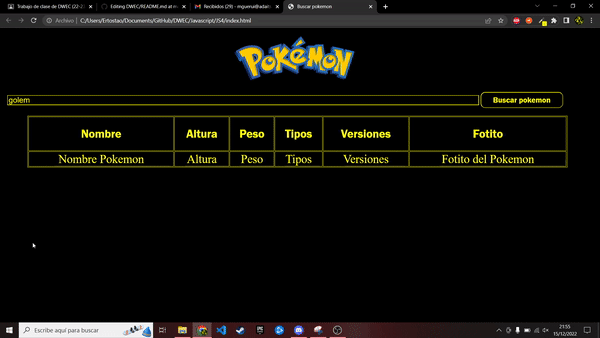
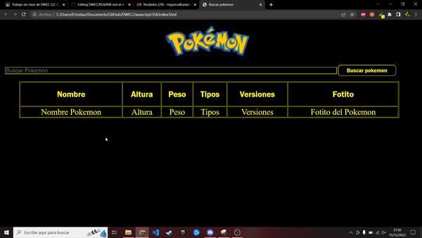

# DWEC
## API Pokemon

> Tarea INTERMEDIA.

### 🔍 Análisis del problema

`Queremos consultar la api de pokemon y mostrar en una tabla los datos que se piden en la tarea`

#### 🤔 ¿Qué son?

**Diagrama de flujo**

---

### 📐 Diseño de la solución

Para realizar este apartado de Tarea INTERMEDIO, he creado un fichero html para el cuerpo de la pagina html y luego lo he llamado desde otro archivo en este caso .JS,donde tengo hecho el script, que contiene las llamadas necesarias a la api , que parseamos a un JSON para tomar los datos.

---

### 💡 Pruebas

**Criterio de aceptación 1**

Dado que busco un pokemon

Cuando pulsamos buscar busca en la api

Entonces tendremos el pokemon mostrado en la tabla

**Criterio de aceptación 2**

Dado que no busco un pokemon

Cuando pulsamos el boton busca en la api

Entonces tendremos muestra que no existe el pokemon

