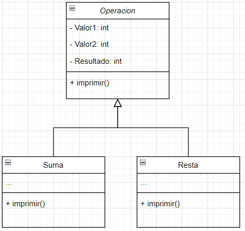
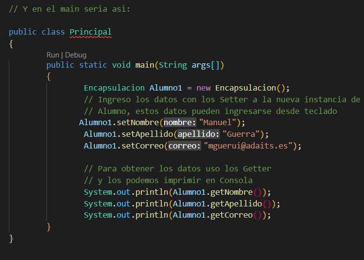
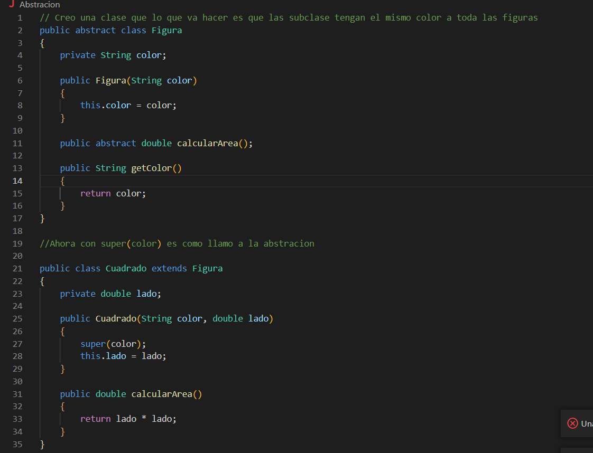
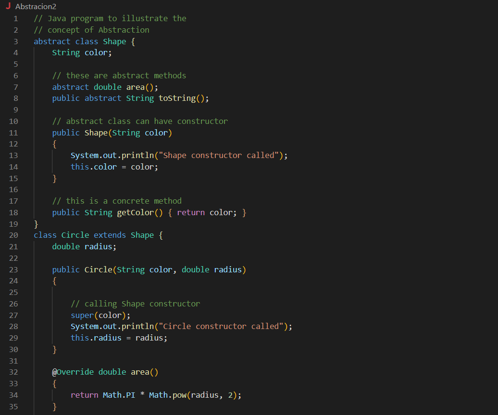
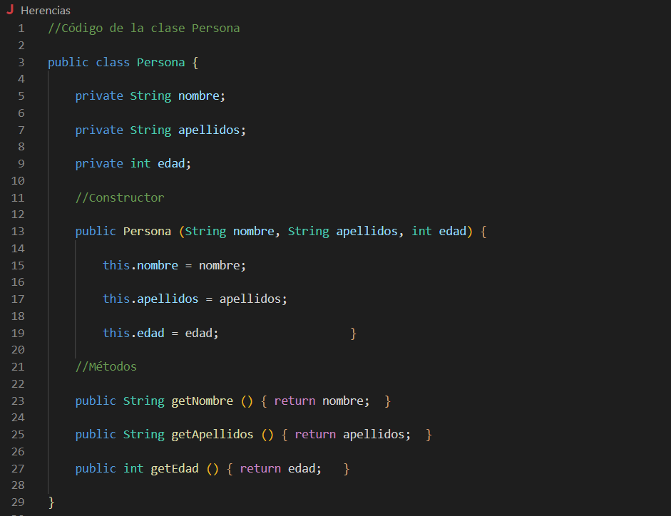
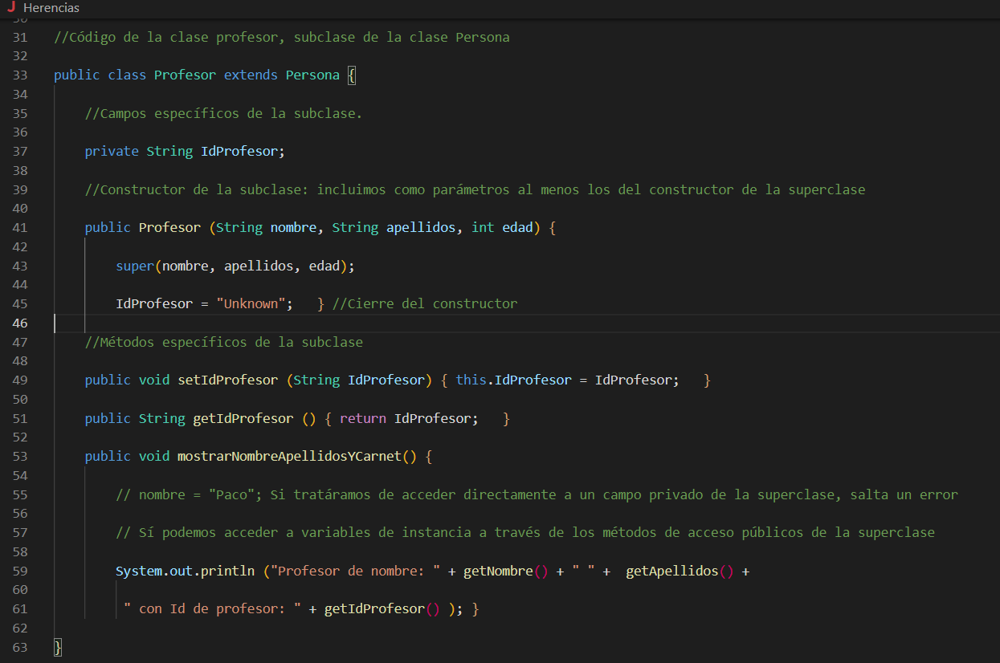

# DWEC
## Programación Orientada a Objetos

> Tarea AVANZADA.

### 🔍 Análisis del problema

`Encapsulación en Java 1.8`

`Abstracción en Java 1.8`

`Herencia en Java 1.8`

`Polimorfismo en Java 1.8`

#### 🤔 ¿Qué son?

**Encapsulación**

`Consiste en ocultar atributos de un objeto de manera que solo se pueda cambiar mediante operaciones definidas en ese objeto.`

**Abstracción**

`Es la propiedad en virtud de la cual solo se muestran al usuario los detalles esenciales`

**Herencia**

`Es un mecanismo que permite la definición de una clase a partir de la definición de otra ya existente. La herencia permite compartir automáticamente métodos y datos entre clases, subclases y objetos.`

**Polimorfismo**

` Es la capacidad que tienen los objetos de una clase en ofrecer respuesta distinta e independiente en función de los parámetros (diferentes implementaciones) utilizados durante su invocación`

---

### 📐 Diseño de la solución

Para realizar este apartado de Tarea AVANZADO, he creado un fichero de Java para cada uno de los ejercicios

---

**UML de ejemplo para la solución**

Suma y resta heredan de operación , y el poliformismo es el resultado de las diferentes operaciónes 

---

### 💡 Pruebas

**Encapsulación**

**Abstracción**

**Herencia**

**Polimorfismo**

